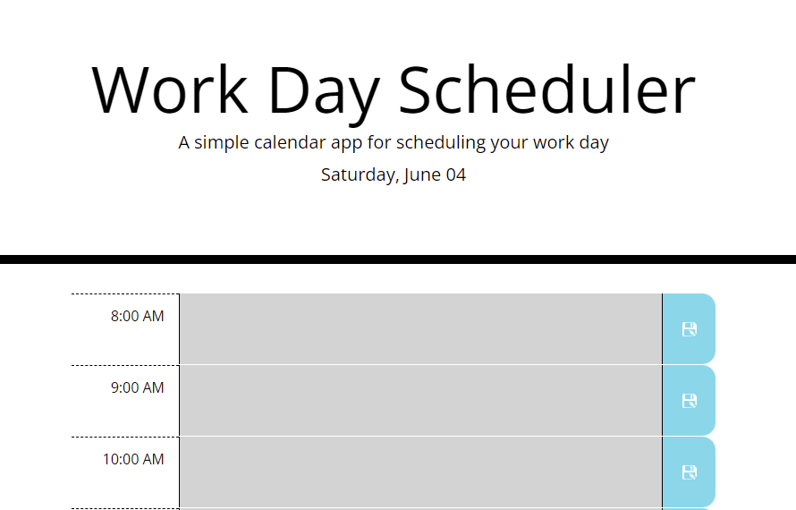

# Work Day Scheduler Starter Code
A daily planner to assist with time management.

Saves what you have written
* write down what you have to do
* hitting save will store what you've written for future reference

Colour coded for your convenience
* grey event blocks have already passed
* red blocks are in the now so go do what you've written
* green blocks are upcoming tasks/events you should keep in mind

## Website

https://jcgcristel.github.io/work-day-scheduler/ 

## Contribution
Joyce C. Garnett